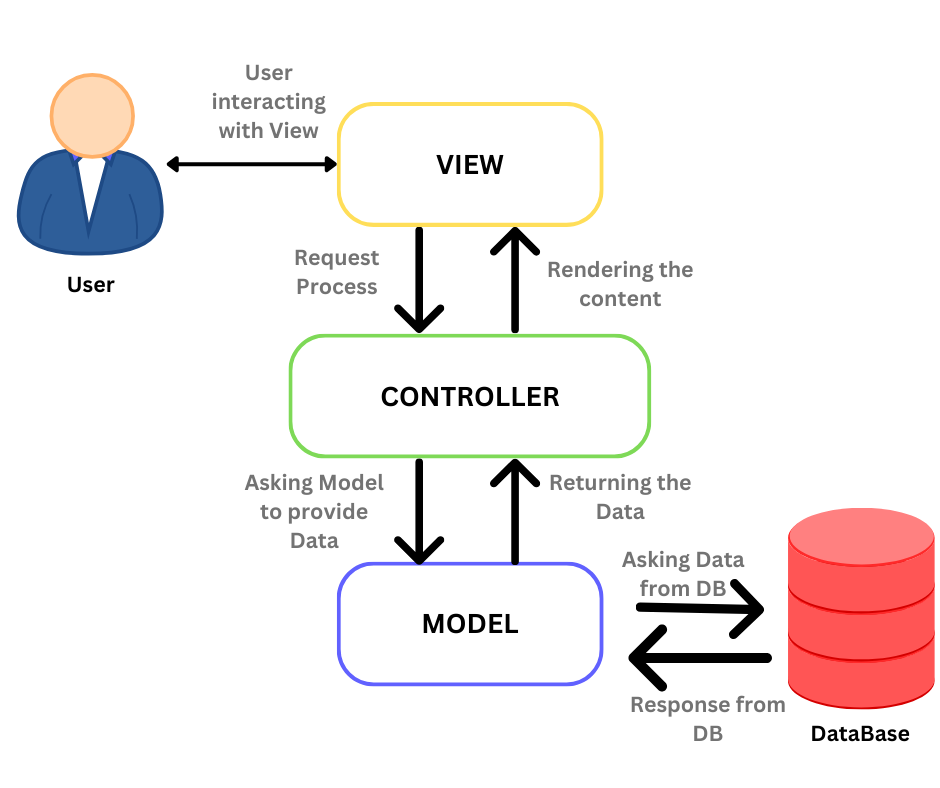
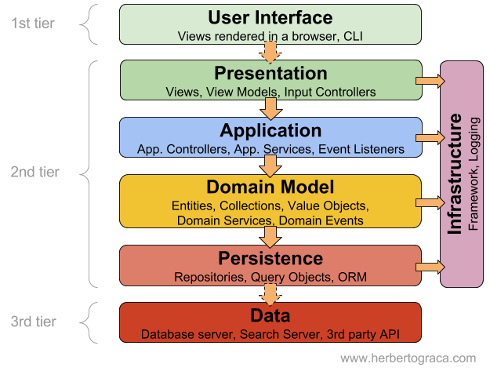
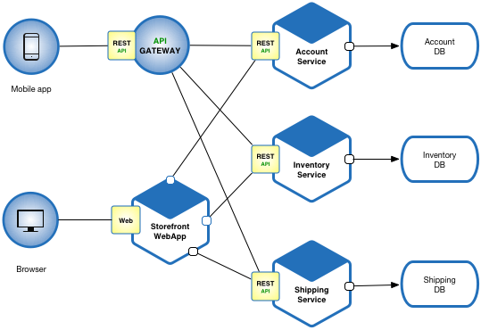

# Understanding and Distinguishing Key Architectural Patterns

## Model-View-Controller (MVC)

The **MVC** pattern separates an application into three main components: the Model, the View, and the Controller, facilitating development, maintenance, and testing by segregating responsibilities.

- **Model**: Manages the data and business logic.
- **View**: Displays data to the user, a visual representation of the model.
- **Controller**: Interfaces between Model and View, handling business logic and user input.

**Suitable Frameworks**:
- **React** for the view layer, with Redux or Context API for state management.
- **Angular** separates app logic (model), content display (view), and user input handling (controller).
- **Ruby on Rails** and **Django** follow MVC, managing data, UI, and control logic distinctly.

**Advantages**:
- Separation of concerns enhances scalability and maintainability.
- Facilitates focused development and testing.
- Components can be reused across the application.

## Layered (n-tier) Architecture

Organizes an application into logical layers, each serving a specific role, offering flexibility, maintainability, and scalability.

**Suitable Frameworks**:
- **Express.js** structures Node.js applications into presentation, business logic, and database access layers.
- **Spring** supports the development of layered Java applications.

**Advantages**:
- Flexibility in changing or adding layers.
- Separation enhances maintainability.
- Independent scalability of layers.

## Service-Oriented Architecture (SOA) vs. Microservices

Both decompose applications into services, but differ in scope and objectives. SOA integrates services for comprehensive solutions, while Microservices focus on small, independent services.

**Suitable Frameworks**:
- **Microservices**: **Spring Boot** and **Flask** or **FastAPI** for lightweight, independent services.
- **SOA**: **Apache Camel** or **Mule ESB** for robust integration and service orchestration.

**Advantages of Microservices**:
- Independence in development, deployment, and scaling.
- Facilitates quicker development cycles.
- Allows for diverse technology use.

**Advantages of SOA**:
- Promotes service reusability.
- Streamlines processes for efficiency.

## Event-Driven Architecture (EDA)

Centers on events for component interaction, excelling in systems reacting to state changes with asynchronous communication and scalability.

**Suitable Frameworks**:
- **Node.js** and **Spring** for their support for asynchronous processing and message handling.

**Advantages**:
- Efficient resource use through asynchronous communication.
- Scalability in handling event volumes.
- Flexibility in adding event processors.

## Real-World Applications

- **MVC**: Used by social media platforms like Facebook.
- **Layered Architecture**: Found in secure and independently updatable banking applications.
- **SOA**: Utilized in healthcare for integrating patient records, appointments, and billing services.
- **Microservices**: E-commerce sites like Amazon for handling listings, accounts, and processing.
- **EDA**: Online gaming platforms for immediate event processing.

By exploring architectural patterns, frameworks, and their real-world applications, students gain valuable insights into the development of scalable, maintainable, and efficient software systems.
