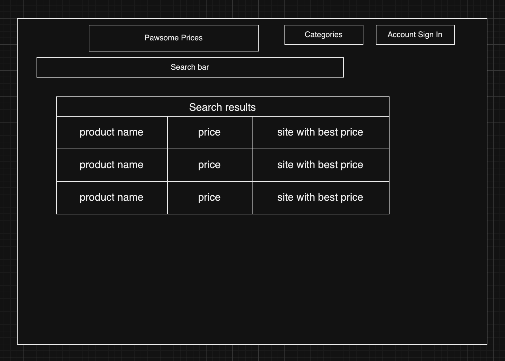

# Software Engineering Class Final Reflection 
## Table of Contents 

- [Product Vision](#product-vision) 

- [Learning and Growth Journey](#learning-and-growth-journey) 

  - [Reflection](#reflection) 

- [Product Showcase](#product-showcase) 

  - [Elevator Pitch](#elevator-pitch) 

  - [Product Demo](#product-demo) 

  - [Technical Architecture Overview](#technical-architecture-overview) 

  - [Codebase Exploration](#codebase-exploration) 

  - [Access Your Work](#access-your-work) 

- [Final Reflection Presentation](#final-reflection-presentation) 

- [Career Readiness Assessment](#career-readiness-assessment) 

  

## Product Vision 

- We want to make a site that does price comparisons for products of certain categories. Pet products are an untapped area with little competition from larger or well-known sites, so it is an area that we can provide value in. Shopping deals sites tend to capitalize on a niche to save users time and money by not having to search through many sites for the products. Since there are not many sites specific to the pet market like there are for electronics, for example, this niche is an area that we can work in to solve a problem for pet owners. 

  

## Learning and Growth Journey 

### Reflection 

   Reflect on your journey in learning software engineering through concrete scenarios: 

1. **Team Collaboration Approach:** 

- We organized our Trello into three boards: one contained our “to-dos”, current tasks, and our completed tasks, as well as an additional blocked list when we decided some tasks were not doable. 

- Trello allowed everyone to see what needed to be done and tasks could be assigned to specific people. 

- Using the different boards, everyone was on task with what they needed to do for the current sprint. 

- Trello helped us to remember features that we wanted to add to the site without needing to go through the whole product persona and architecture documentation 

2. **Challenges and Overcoming Them:** 

   Recall a specific challenge, like debugging a code issue together. Explain how you collaborated to identify the bug's source and successfully resolved it. This experience showcases your problem-solving and teamwork skills. 

- Getting search to return multiple values. Initially it would only return one item, even though we knew that there were multiple items with a similar name in the database. We read the Django documentation about models and serializers, and were able to figure out the proper way to create the search endpoint and have it return all the values that matched the search string 

- Learning how to add products to the database. Initially we were adding items manually and it wasn’t very efficient. Trying to create an api endpoint that did this was challenging because it was one of the first endpoints that we created that would do something like this. The challenge was a combination of learning the different Django terminology and how that translated into terms that we understood, learning how to create an api, and figuring out the right way to make this type of call to the Django model. The Django documentation was helpful here. 

- Getting the wishlist model to only require username and product.id, but then return all the product data when that endpoint is called. We learned that we could update the wishlist serializer to just accept a product ID, but then have that serializer reference the product serializer to return the other values when called. 

- Connecting the frontend to the backend to display items in the database that lead to individual product pages. 

  

3. **Accomplishments and Pride:** 

- **Sean Parks**- Kept the team on track with the tasks that needed to be done each week and developed the base of the frontend, educating other team members on how React worked. 

- **Stanely Aaron**- Developed the base of the backend to manipulate and returns products and wishlist items, educating other team members on how Django worked. 

- **Nick Parks**- managed the database and worked on the user and admin authentication Api endpoints. 

- **Michael Edem**- created the login frontend and the git repository, giving his thoughts to keep the scope and goals of the project realistic 

4. **Learning and Growth:** 

   Provide an example of how you applied a concept learned in class to a practical scenario. Describe how you used version control (like Git) to collaborate on a coding assignment, improving code organization and collaboration. 

- The “restaurant waiter system” described in class helped to give us a better vision to how we should communicate between the frontend and backend, it was with this methodology and thinking that we enabled the ability to add and search for products on our website 

- For our final feature, which was fixing the admin add item form, we were collaborating on a teams call. The people working on the frontend needed to debug the format of the data the frontend was sending to the add item endpoint, and when we needed to change things in the backend, we were able to push code to each other through git to collaboratively work and fix all the issues. 

- We started to rely on Git to be able to make a few test changes and then revert them as we were working through issues, or make incremental changes that we’d commit as we felt the code was where we wanted it. 

  

## Product Showcase 
### Elevator Pitch 

- Why spend big money buying pet products online when Pawsome Prices can tell you when and where the best deals are? With our website you can keep a close eye on all your favorite products perfect for your furry best friend. Signing up is free and simple, you can even wishlist your favorite items for later, so don’t miss out on this huge cost-saver for man's best friend! 

### Product Demo 

   Share simple examples of your product's functionality: 

**Example 1: Admin adds product to database:** administrative users have the ability to add products from other shopping websites to our database, so that regular users can keep tabs on their price changes. 

**Example 2: User can signup and login:** users can register easily to our website and add any items they find to their own Wishlist. 

**Example 3: User views item and wants to buy it:** users can browse for items, check whether Amazon or Walmart have the lowest price for that item, and visit the link to buy the one they want from its respective retailer. 

**Example 4: Add item to wish list:** a user who likes to purchase an item regularly can add it to their wish list to watch for price changes. 

**Example 5: User searches for a product:** any user can access our search bar to find a specific product which interests them. 

  

### Technical Architecture Overview 

**Example 1: Frontend communicating with API like a restaurant menu:** 

- API Endpoints – Imagine a website like a restaurant, and the backend server works like the chef cooking in the kitchen. The chef has a menu of dinners he prepares that represents the available services or actions that the restaurant offers. Each item on the menu corresponds to an endpoint or API (Application Programming Interface) on the backend server. 

**Example 2: User authentication nightclub comparison:** 

- Authentication – A person wants to go inside of a nightclub, but only people who are on the list are allowed in. When a person arrives, they give the bouncer their name and ID. The bouncer then checks the list for the person’s name, and makes sure that the person’s name matches their ID. The bouncer doesn’t want to check the list for this person each time that the person comes in on that night, so he gives them a sticker that the person can show the next time, and the bouncer will let them right in. There are other bouncers inside that check for the sticker before letting the person go on the dance floor or buy a drink. There is a door that leads to the stock room that is for employees only, and the person is not allowed back there with their sticker, but the bouncers can because they have an employee sticker. 
This explains a user passing a username and password, the authentication system returning a token, and the token being used to access api endpoints. It also explains the different level of access that an administrator has compared to a user.  

### Codebase Exploration 
   Illustrate a coding concept with a relatable analogy: 

 **Analogy: React components are like building a house** 

- React Components – Instead of having one html file for all the frontend tags, react allows you to create your own components and implement them as custom tags. The base file is like a foundation for a house, and components like the wall, doors, windows, and roof can be defined in their own files. Instead of reinventing the wheel every time you want another door or another window, you can just add a door component or a window component to your foundation. If multiple people are building the house, only the person making the door needs to know how the door is made. The people putting it where it needs to go only need to know that it is a door. Defining all the complex code in a high-level tag allows components to be built and reused in a way that is more organized and readable. 

### Access Your Work 

- **[Presentation Slides](https://onedrive.live.com/edit?id=4CEFB60D7CFBF1C7!180&resid=4CEFB60D7CFBF1C7!180&ithint=file%2cpptx&authkey=!AARYDJHv-dax6e8&wdo=2&cid=4cefb60d7cfbf1c7)** 

- **[Source Code Repository](https://github.com/MichaelEdemRIC/CSCI401W-Fall2023--Team-Theta-)** 

- **Other Materials:** 

**[ Website layout concept images ]** 

  **Dashboard:**
  

  **Search Results:**
  
  
  **Example Product Page:**
  

  **Wishlist page:**
  

**[ C-4 Diagram for our original backend plan ]** 

  **System Context:** 
  
  
  
  **Container:** 
  
  
  
  **Component:** 
  
  

## Final Reflection Presentation 

- **[Presentation Video](https://emailric-my.sharepoint.com/:v:/g/personal/sparks_1017_email_ric_edu/EenUEfO4VzpFrKB_WkTFr3EBktTxiNy8S96mIWCiE2oeBA?e=zDoIIv&nav=eyJyZWZlcnJhbEluZm8iOnsicmVmZXJyYWxBcHAiOiJTdHJlYW1XZWJBcHAiLCJyZWZlcnJhbFZpZXciOiJTaGFyZURpYWxvZy1MaW5rIiwicmVmZXJyYWxBcHBQbGF0Zm9ybSI6IldlYiIsInJlZmVycmFsTW9kZSI6InZpZXcifX0%3D)** 

## Career Readiness Assessment 

1. **Team Collaboration Skills:** Reflect on a time when coordinating with team members improved a project's outcome or efficiency. 

- **Sean Parks** - When connecting the frontend to the api endpoints in order to display things like the database or wishlist elements, there were times where Aaron and I or Nick and I worked together to debug what the backend was expecting and how I needed to format the frontend request so that the data was sent correctly. Because I focused less on the backend, I was unfamiliar with what certain endpoints were expecting, but through having them update the readme and explain it to me, I better understood how the backend worked by interacting with it. 

- **Stanley Aaron** - worked back and forth with Sean to get image uploads to work, and Mike suggested that we use ChatGPT to help debug. We pasted in our code and it gave the suggestion to use a multi part form to submit this data and reference an actual image file instead of a string. We were able to take this suggestion and tailor it to our needs. We can now upload images when creating new products in our database. 

- **Nick Parks**  - me and Aaron worked together several times on the backend over the course of the project. I worked on the models for users in the database, while he worked on giving each user the capability to save the wishlist. In addition, we also agreed on an authentication method that would work best for authenticating users in our project. 

- **Michael Edem** : often we collaborate with each other on how to implement different functions and components to our website, this back and forth between us has led to great success in our project one example being when me and Sean worked together for one Monday afternoon to get the login system up and running. 

2. **Problem-Solving Abilities:** Share a situation where you had to troubleshoot a technical issue and how you approached the problem-solving process. 

- Broke the ability to add items to a wishlist. An endpoint called add_wishlist_item was created and tested, and we were able to add items to a user’s wishlist. After this, an update was added to the Wishlist serializer that would make it return all the product details of that item by referencing it’s product ID. That piece was tested too, and all seemed well. In the future, in a new git branch, when working on adding some more items to a wishlist, we kept getting errors and tried different things to get it to work. We used git to checkout an old commit and found that updating the serializer to return all of the product information made the serializer only accept items that had all of the product information, instead of just the ID like we wanted. We were able to correct this and have it work as intended. 

3. **Contributions to the Project:** Discuss a specific task you contributed to and how your involvement positively impacted the project's development. 

- **Sean Parks** - I developed the general site layout and connected the site to the backend so that it could be functional. I also established a lot of the general styling for the site with the logo, color scheme, and organization. 

- **Stanley Aaron** - the initial backend setup and initial product endpoints. This allowed us to present something that the frontend was able to connect to and pull data from. 

- **Nick Parks**  - I worked on getting a user model for us to use for storing users in the database. Initially I created a custom model for use by the project, but instead I decided to use the default model that comes with Django Rest Framework instead. In addition, I researched session authentication and implemented it into our user and admin authenticated endpoints. 

- **Michael Edem** I developed an early version of the login page to our website, this acted as a first steppingstone to our development of the account system giving each user the ability to make their own account and add their favorite items to a Wishlist.
